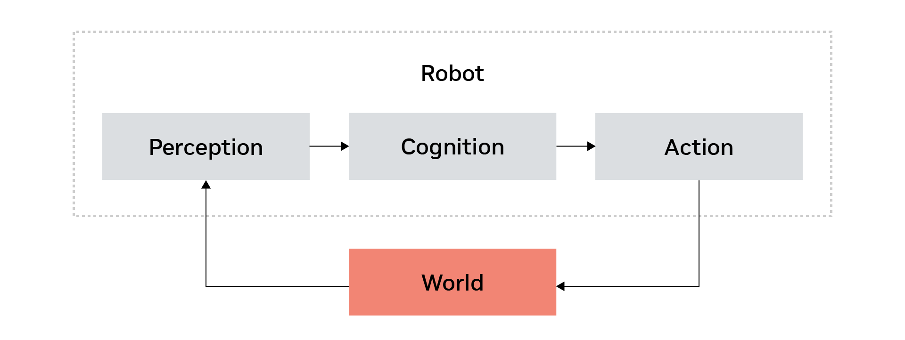
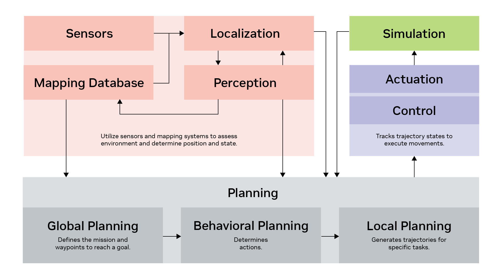
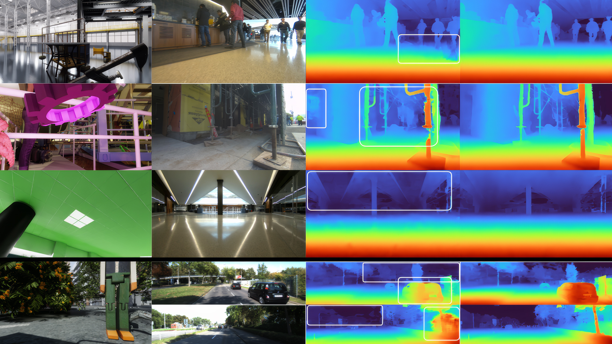

# 自主机器人入门指南

### 概述

欢迎参加本入门课程，我们将概述自主机器人、机器人系统和架构。然后，我们将介绍自主软件的高级架构，从传统方法开始，包括感知与感知、测绘、定位、导航与控制，以及当前机器人技术的发展趋势和未来方向。

在本课程中，我们将：

- 识别自主机器人的关键组件和类型。
- 描述机器人具身AI的基本原理。
- 识别机器人系统和架构的主要元素。
- 列出机器人中使用的主要传感器和感知技术。
- 概述自主导航中定位与测绘的基本概念。
- 回顾机器人控制系统的基本原理。
- 识别当前机器人技术中的趋势和挑战，包括基础模型的使用。

首先，让我们从自主机器人的概述开始。

## 自主机器人基础

### 概述

在**自主机器人基础**模块中，我们将探索推动机器人领域发展的核心概念。从了解自主机器人在各行业中的多样化应用，到掌握具身AI的基本原理，本模块将为您提供机器人学基础的坚实根基。

在本模块结束时，您将能够：

- 识别不同行业使用的各种类型的自主机器人
- 描述机器人具身AI的基本概念
- 列出机器人感知-认知-行动循环的关键组件
- 回顾人机交互在现代机器人应用中的重要性

这些目标将指导您了解自主机器人的关键方面，帮助您理解机器人如何感知、思考和与环境互动。无论您对工业自动化、医疗机器人还是AI前沿研究感兴趣，本模块都将为您提供理解和欣赏自主机器人系统复杂性和潜力的知识。

随着我们课程的深入，您将深入了解机器人的跨学科性质，结合计算机科学、工程学和认知科学的元素。准备好踏上进入自主机器人世界的激动人心的旅程。

### 自主机器人

自主机器人有多种类型，包括水下机器人、无人机、机器人出租车、家用机器人、救援机器人、四旋翼飞行器、四足机器人、人形机器人、外骨骼和机械臂。

机器人在各行各业都有应用，包括制造业、医疗保健、农业、物流、运输、勘探、家用、零售、教育、公共安全和娱乐。正如您所看到的，几乎每个市场都可能受到机器人的影响，那么从高层来看，什么是机器人技术？机器人技术是如何工作的？

------

这张图为我们提供了具身AI的概述。如果您思考机器人是如何工作的，这与人类的工作方式非常相似。我们用眼睛进行感知，用大脑进行认知，用我们所有的执行器——手和腿——进行行动。这就是人类和机器人与世界互动的方式。

感知接收世界上正在发生的事情，该输出被发送到机器人的认知或大脑，然后机器人采取行动与世界互动。

### 具身AI

具身AI是物理AI的一个子集，代表着机器人和人工智能的重大飞跃，使机器人能够以越来越复杂的方式与物理世界互动。

------

#### 自主导航

具身AI的主要能力之一是自主导航。这使得机器人能够独立地在各种环境中移动，自主决定路径并避开障碍物，无需人工干预。

------

#### 物体操作

物体操作是具身AI的另一个关键方面，包括：

- **抓取**：安全握住不同形状和尺寸物体的能力
- **复杂操作**：执行精细任务，如组装零件或叠衣服

这些技能使机器人能够以与人类能力非常相似的方式与其环境互动。

### 人机交互

人工智能的最新进展彻底改变了机器人与人类互动的方式。这包括：

- **自然语言处理**：使人与人之间能够使用口语或书面语言进行交流。
- **协作**：允许机器人在各种共同任务中与人类并肩工作，从制造到医疗设施。

大型语言模型的出现进一步增强了人机交互。这些模型显著提高了机器人理解和响应复杂命令和查询的能力，使互动更加自然和直观。

### 回顾

祝贺您完成**自主机器人基础**模块！在本次基础部分中，我们探索了推动机器人领域发展的核心概念。让我们回顾一下我们学到的内容。

在本模块中，我们：

- **识别了不同行业使用的各种类型的自主机器人**。从制造业和医疗保健到农业和空间探索，自主机器人正在改变每个行业。
- **描述了机器人具身AI的基本概念**。我们现在了解了机器人如何感知、思考和行动。
- **列出了机器人感知-认知-行动循环的关键组件**。
- **回顾了人机交互在现代机器人应用中的重要性**。自然语言处理和协作方面的进展正在增强我们与机器人互动的方式。

这些目标为您提供了机器人学基础的坚实根基。您现在更好地理解了机器人在各行业的运作方式以及它们如何与环境互动。

我们探索了机器人技术的跨学科性质，结合了计算机科学、工程学和认知科学的元素。这些知识将为我们深入研究即将到来的模块中的机器人系统和架构奠定基础。

随着我们课程的深入，我们将建立在这些概念之上，探索自主机器人更高级的主题。准备好深入研究我们下一个模块中机器人系统和软件架构的复杂性。

## 机器人系统与架构

### 概述

在**机器人系统与架构**模块中，我们将深入研究构成机器人系统的基础组件，并探索它们如何协同工作以创建功能性的自主机器人。我们将检查机器人的硬件和软件之间复杂的相互关系，并了解机器人架构的关键元素。

在本模块结束时，您将能够：

- 识别机器人系统的主要组件，包括硬件和软件元素。
- 描述机器人集成过程及其在创建统一系统中的重要性。
- 认识到仿真和测试在机器人开发中的作用。
- 概述自主软件架构的基本结构。
- 解释关键硬件组件（如传感器、执行器和控制器）的功能。

随着我们课程的深入，我们将探索机器人的硬件和软件方面，为您提供这些复杂系统如何结合的全面视图。准备好揭开机器人系统的内部运作，并更深入地欣赏自主机器人背后的工程。

### 机器人集成

机器人系统的核心在于硬件和软件组件的无缝协作。这个集成过程涉及：

- **硬件组件**：传感器、执行器和使机器人能够与环境互动的其他物理部件。
- **软件系统**：控制和机器人行为和决策过程的程序和算法。

目标是创建一个统一的系统，所有部件协同工作，实现复杂操作和机器人内部的通信。

------

#### 仿真与测试

仿真环境（如NVIDIA Isaac Sim、NVIDIA Isaac Lab或Gazebo）帮助我们在将机器人部署到现实世界场景之前验证整个系统。我们还可以利用各种测试框架，如硬件在环（HIL）测试、软件在环（SIL）测试，以及单元测试或系统级测试。

------

#### 开发框架

机器人开发通常依赖专业平台和框架。一个值得注意的例子是ROS（机器人操作系统），它提供了一个编写机器人软件的灵活框架。其他中间件操作系统也可以使用。

### 硬件集成

硬件集成的目标是将各种硬件组件组合成一个无缝协作的统一系统，以确保传感器、执行器和控制器之间可靠高效的交互。

------

#### 传感器

传感器对于环境感知、导航辅助和控制系统的反馈至关重要。常见类型包括：

- **摄像头**：用于视觉输入
- **激光雷达**：用于距离测量
- **IMU（惯性测量单元）**：用于方向定位
- **GPS**：用于位置跟踪

------

#### 执行器

执行器根据传感器反馈实现运动和操纵，应用力量并进行调节。执行器类型包括：

- **电机**：用于运动的直流电机和步进电机
- **舵机**：用于精确位置控制
- **气动和液压执行器**：用于力量应用

------

#### 控制器

控制器处理传感器数据、执行控制算法并促进组件之间的通信。示例包括：

- **微控制器**：如Arduino和PIC
- **单板计算机**：如Raspberry Pi和NVIDIA Jetson
- **嵌入式系统**：用于集成控制解决方案

------

集成过程涉及确保所有硬件组件高效协同工作

### 自主软件架构

这张图提供了一个相对复杂的自主软件架构概述，常用于机器人出租车等应用。它展示了对自主系统必不可少的各种组件的集成，尽管某些机器人可能只使用这些元素的子集。

- **感知与定位**：利用摄像头和激光雷达等传感器以及测绘系统来评估环境并确定机器人的位置和状态。
- **规划**：涉及多个阶段：
  - **全局规划**：类似于在地图上设置路线，定义任务和到达目标的路点。
  - **行为规划**：确定要执行的动作，如操纵哪个物体以及如何操纵。
  - **本地规划**：为特定任务生成轨迹，引导机器人沿精确路径移动。
- **控制与驱动**：控制器跟踪轨迹状态以执行运动，无论是操作还是导航。结果在虚拟仿真和现实世界中进行测试。
- **反馈循环**：持续从传感器和定位收集数据，以完善规划并提高系统性能。这个迭代过程确保了适应性和响应性的机器人行为。

### 回顾

祝贺您完成**机器人系统与架构**模块！让我们回顾一下我们学到的内容。

在本模块中，我们：

- **识别了机器人系统的主要组件，包括硬件和软件元素**。我们探索了传感器、执行器和控制器如何协同工作，形成机器人系统的物理基础。
- **描述了机器人集成过程及其在创建统一系统中的重要性**。我们学习了如何将硬件和软件组件组合以创建功能性机器人系统，强调无缝协作的重要性。
- **认识到仿真和测试在机器人开发中的作用**。我们发现了NVIDIA Isaac Sim和各种测试框架等工具对于在现实世界部署之前验证机器人系统的重要性。
- **概述了自主软件架构的基本结构**。我们检查了自主软件的关键组件，包括感知、规划和控制，以及它们如何相互作用以实现自主行为。
- **解释了关键硬件组件（如传感器、执行器和控制器）的功能**。我们深入研究了每个组件的具体示例，了解它们在使机器人感知环境并与之有效互动方面的作用。

本模块为您理解机器人系统的构建和集成提供了坚实的基础。您现在了解了机器人的硬件和软件方面，为您提供了这些复杂系统如何结合的全面视图。

随着我们继续前进，我们将建立在这些知识上，探索自主机器人更高级的主题。下一个模块将重点关注机器人如何理解和与其环境互动，应用我们在这里学到的架构概念。

## 使自主机器人能够理解其环境

### 概述

在**使自主机器人能够理解其环境**模块中，我们将探索允许机器人感知、解释和与其周围环境互动的基本技术和过程。理解机器人如何感知世界对于掌握自主系统的全部潜力至关重要。

在本模块结束时，您将能够：

- 识别机器人使用的各种类型的传感器及其具体应用。
- 描述机器人系统中的感知和传感器融合过程。
- 解释自主导航中的定位和测绘概念。
- 概述机器人导航和路径规划的基础知识。
- 认识到控制系统在执行机器人运动中的作用。

我们将深入研究机器人传感生态系统，从摄像头和激光雷达到更专业的传感器。您将学习机器人如何组合来自多个来源的数据以构建对其环境的全面理解。我们还将探索机器人定位、测绘和导航中的挑战和解决方案——这是任何自主系统的基本技能。

本模块构成了理解机器人架构和欣赏现代自主机器人高级能力之间的桥梁。无论您对开发机器人系统、使用自动驾驶汽车感兴趣，还是只是对机器人如何"思考"感到好奇，本模块都将为您提供对实现机器人自主性的核心技术的宝贵见解。

### 感知

感知对于使自主机器人理解其环境至关重要。本概述探讨了机器人使用的不同类型的摄像头和传感器，强调它们独特的优势和应用。

------

#### 摄像头类型

- **单目摄像头**：捕获2D图像的单镜头摄像头。它们简单、成本效益高、且广泛可得，使其成为基本物体检测、图像识别和简单导航任务的理想选择。
- **立体摄像头**：使用两个镜头同时捕获图像，模仿人类双眼视觉。这种设置提供深度感知和3D信息，用于障碍物回避和3D测绘。示例包括Hawk 3D深度摄像头。
- **RGB-D摄像头**：将标准RGB彩色成像与深度传感相结合，提供强大的3D感知。这些摄像头有利于高级导航、物体操纵和交互。Intel RealSense立体RGB-D摄像头是一个受欢迎的选择。
- **热摄像头**：检测红外辐射以基于温度差异创建图像。它们在黑暗环境或烟雾和雾气中有效，使其对搜索、救援和监视操作非常有价值。
- **事件摄像头**：提供高时间分辨率和低延迟，非常适合高速运动检测和跟踪。

了解这些摄像头类型有助于为特定机器人应用选择正确的传感器，增强机器人感知和与其周围环境互动的能力。

------

#### 激光雷达类型

- **2D激光雷达**：更简单、更便宜、更快，但功能有限。适用于基本平面导航和障碍物检测。
- **3D激光雷达**：提供详细的空间信息、宽视野和高分辨率，使其适用于自动驾驶汽车测绘。然而，它通常比摄像头更昂贵。
- **固态、闪光和MEMS激光雷达**：提供耐用性和成本效益，使用激光脉冲测量距离并创建详细地图。

延伸阅读：[激光雷达遥感是如何工作的？光检测和测距](https://www.youtube.com/watch?v=EYbhNSUnIdU)

------

#### 其他常见传感器

- **超声波传感器**：发射声波并基于回波返回时间测量距离。价格实惠，常用于扫地机器人等低成本机器人。
- **雷达**：在各种条件下可靠，提供距离、速度和尺寸信息。用于机器人出租车等应用。
- **GPS**：对室外定位至关重要。
- **IMU（惯性测量单元）**：测量加速度和旋转速率以跟踪运动和方向。广泛应用于移动机器人。
- **轮式编码器**：测量轮旋转以确定行驶距离。
- **磁传感器（罗盘）**：检测地球磁场以确定方向并提供航向信息。
- **环境传感器**：测量温度、湿度和空气质量。
- **触觉传感器**：成本效益高，用于检测接触，常用于家用机器人。

------

这些传感器共同增强了机器人感知其周围环境并基于实时数据做出明智决策的能力。

### 感知

在机器人领域，感知对于使自主机器人理解其环境至关重要。就像人类使用视觉、听觉和触觉的组合来解释周围世界一样，机器人依赖传感器融合。这个过程整合来自多个传感器的数据，以创建环境的全面和准确的表示。

------

#### 感知的关键组件

- **传感器融合**：组合来自各种传感器的数据，提供周围的整体视图。
- **物体检测与识别**：识别和分类机器人环境中的物体。
- **物体跟踪**：连续跟随移动的物体，类似于我们的眼睛跟踪移动物体。
- **场景理解**：解释环境的整体上下文，允许机器人做出明智的决策。

------

#### Isaac Perceptor

NVIDIA开发了Isaac Perceptor，这是一种为移动机器人设计的基于摄像头的3D感知系统。该系统提供：

- **鲁棒测距**：跟踪机器人通过其环境移动，类似于我们在行走时判断位置的方式。
- **本地3D场景重建**：构建周围的三维地图，以辅助自主导航。
- **高度感知**：检测表面和障碍物，实现安全导航。

这些能力使机器人能够在复杂环境中有效运作，从仓库到公共场所。

------

#### 感知算法

感知算法处理传感器数据以提取有意义的见解。关键算法包括：

- **SLAM（同时定位与测绘）**：构建环境地图同时跟踪机器人在其中的位置。
- **物体检测**：使用深度学习识别图像中的物体。
- **语义分割**：为图像中的每个像素分配类别标签，实现对环境的详细理解。

------

### 测绘与定位

测绘与定位是自主导航的基本能力。机器人需要知道自己在哪里以及周围环境是什么才能有效运作。

------

#### 测绘

测绘是创建环境表示的过程。这可以是：

- **2D地图**：适用于平面导航，如仓库中的机器人。
- **3D地图**：提供环境的全面表示，对复杂环境中的导航至关重要。
- **语义地图**：包含对象类别等信息，支持更智能的决策。

------

#### 定位

定位是确定机器人相对于环境的位置的过程。技术包括：

- **全局定位**：使用GPS或地标在较大尺度上确定位置。
- **本地定位**：使用传感器数据在较小尺度上跟踪位置。
- **绝对定位**：精确确定机器人的确切位置和方向。
- **相对定位**：跟踪相对于起始位置的位置变化。

------

#### SLAM

SLAM（同时定位与测绘）是机器人在未知环境中导航的关键技术。它同时：

- 构建环境地图
- 跟踪机器人在该地图中的位置

SLAM使用各种传感器数据，包括来自摄像头、激光雷达和IMU的数据，以创建一致的环境表示并准确定位机器人。

### 导航与控制

导航与控制是使机器人能够移动和执行任务的核心能力。

------

#### 导航

导航涉及从一点到另一点的运动规划。关键组件包括：

- **路径规划**：找到从当前位置到目标的最佳路径。
- **避障**：检测并绕过障碍物。
- **运动控制**：执行计划的动作。

导航算法使用来自传感器和地图的数据来做出关于机器人运动的明智决策。

------

#### 路径规划

路径规划是找到从起点到终点的最优路径的过程。常见算法包括：

- **A*算法**：一种基于图形的路径规划算法。
- **RRT（快速探索随机树）**：一种用于高维空间的采样算法。
- **势场法**：使用人工势场引导机器人绕过障碍物。

------

#### 控制

控制涉及执行计划的动作。关键概念包括：

- **反馈控制**：使用传感器数据调整动作。
- **前馈控制**：基于模型预测进行动作。
- **PID控制**：比例-积分-微分控制，一种常见的控制方法。
- **MPC（模型预测控制）**：一种高级控制方法，对复杂系统有效。

------

#### 轨迹跟踪

轨迹跟踪是机器人遵循计划路径的过程。控制器：

- 计算跟踪误差
- 调整电机输出
- 确保平滑准确的动作

有效的轨迹跟踪对于机器人执行精确任务至关重要。

### 回顾

祝贺您完成**使自主机器人能够理解其环境**模块！让我们回顾一下我们学到的内容。

在本模块中，我们：

- **识别了机器人使用的各种类型的传感器及其具体应用**。我们探索了摄像头（包括单目、立体和RGB-D）、激光雷达（包括2D和3D）以及其他传感器（如超声波、雷达和IMU）。
- **描述了机器人系统中的感知和传感器融合过程**。我们了解了机器人如何整合来自多个传感器的数据以创建环境的全面视图。
- **解释了自主导航中的定位和测绘概念**。我们深入研究了SLAM以及机器人如何创建和利用环境地图。
- **概述了机器人导航和路径规划的基础知识**。我们探索了路径规划算法和避障技术。
- **认识了控制系统在执行机器人运动中的作用**。我们了解了反馈控制、PID和MPC等控制方法。

本模块为您提供了对机器人如何感知和理解其环境的深入理解。您现在了解了用于使机器人能够智能地感知、测绘、定位、导航和控制运动的技术和过程。

当我们继续学习机器人控制软件架构模块时，我们将建立在这些知识基础上，探索机器人如何整合感知、规划利控制来执行复杂任务。

## 机器人控制软件架构

### 概述

在**机器人控制软件架构**模块中，我们将探索控制机器人运动的软件系统和算法。从低级电机控制到高级任务规划，控制软件是自主系统的神经系统。

在本模块结束时，您将能够：

- 描述机器人控制软件架构的层次结构。
- 解释各种控制算法及其应用。
- 了解感知、规划和控制如何整合。
- 认识到安全性和容错在机器人控制中的重要性。
- 识别机器人软件中的关键挑战和解决方案。

我们将深入研究控制理论的迷人世界，从经典控制方法到现代AI增强方法。准备好发现使机器人能够精确高效运动的算法和软件系统。

### 控制层次结构

机器人控制通常被组织成层次结构，每个级别处理不同抽象级别的决策。

------

#### 任务级控制

任务级控制处理高级任务执行。这包括：

- 理解任务目标
- 将任务分解为子目标
- 协调多个机器人或机械臂

任务级控制器使用任务规划算法来确定执行复杂任务的最佳序列。

------

#### 运动级控制

运动级控制处理运动规划和轨迹生成。这包括：

- 生成平滑有效的轨迹
- 考虑运动学和动力学约束
- 优化运动以提高效率

运动级控制器为关节和末端执行器生成参考轨迹。

------

#### 关节级控制

关节级控制处理单个关节或执行器的控制。这包括：

- 位置控制
- 速度控制
- 力/扭矩控制

低级控制器直接与硬件接口，确保精确响应。

### 控制算法

各种控制算法用于机器人控制，每种算法都有其优势和应用。

------

#### PID控制

PID（比例-积分-微分）控制是最广泛使用的控制方法之一。它结合：

- **比例项（P）**：响应当前误差
- **积分项（I）**：响应累积误差
- **微分项（D）**：响应误差变化率

PID控制器简单、稳健且广泛适用。

------

#### 模型预测控制（MPC）

MPC是一种高级控制方法，它：

- 使用系统模型预测未来行为
- 优化控制动作以最小化成本函数
- 考虑约束和限制

MPC对于复杂非线性系统特别有效。

------

#### 自适应控制

自适应控制调整控制参数以响应系统变化。这对于：

- 处理不确定或变化的系统参数
- 补偿组件老化
- 适应负载变化

自适应控制器持续学习系统行为并调整其参数。

------

#### 学习控制

学习控制使用机器学习来改进控制性能。这包括：

- 强化学习：通过试错学习控制策略
- 模仿学习：从专家演示中学习
- 深度学习：使用神经网络进行复杂控制

学习控制对于难以建模的系统特别有价值。

### 规划和控制的整合

规划和控制必须紧密整合以实现有效自主。

------

#### 感知-规划-控制循环

自主机器人通常实施感知-规划-控制循环：

1. **感知**：传感器收集环境数据
2. **规划**：基于感知数据计算动作
3. **控制**：执行规划的动作
4. **重复**：持续循环

这个循环使机器人能够动态响应环境变化。

------

#### 行为克隆

行为克隆是一种从演示中学习控制策略的方法。机器人：

- 观察专家执行任务
- 学习将状态映射到动作
- 复制专家行为

行为克隆对于复杂任务特别有用。

------

#### 强化学习规划

强化学习（RL）可用于学习规划策略。RL代理：

- 与环境互动
- 接收奖励或惩罚
- 学习最大化累积奖励的策略

RL已成功应用于机器人操纵和导航。

### 安全性与容错

安全性和容错对于实际机器人部署至关重要。

------

#### 安全约束

安全约束确保机器人在安全参数内运行。这包括：

- 关节限位
- 速度限制
- 碰撞检测
- 紧急停止

安全系统监控机器人行为并在危险情况下干预。

------

#### 容错控制

容错控制使机器人能够处理组件故障。策略包括：

- 故障检测和诊断
- 重新配置控制以补偿故障
- 在降级模式下继续操作

容错对于安全关键应用（如医疗和探索）尤为重要。

------

#### 监控和日志

监控和日志记录对于调试和合规性至关重要。这包括：

- 记录传感器数据
- 跟踪控制动作
- 监控组件健康

全面的日志记录支持故障排查和系统改进。

### 回顾

祝贺您完成**机器人控制软件架构**模块！让我们回顾一下我们学到的内容。

在本模块中，我们：

- **描述了机器人控制软件架构的层次结构**。我们探索了从任务级到关节级的各个级别。
- **解释了各种控制算法及其应用**。我们了解了PID控制、MPC、自适应控制和学习控制。
- **了解了感知、规划和控制如何整合**。我们探索了感知-规划-控制循环以及规划和控制的不同整合方法。
- **认识到安全性和容错在机器人控制中的重要性**。我们讨论了安全约束、容错控制和监控。
- **识别了机器人软件中的关键挑战和解决方案**。我们探索了实时性能、鲁棒性和适应性问题。

本模块为您提供了对机器人控制软件系统复杂性的深入理解。您现在了解了控制算法的层次结构、规划和控制的整合方法，以及安全性和容错的重要性。

当我们继续学习机器人的当前趋势和未来方向模块时，我们将建立在这些知识基础上，探索AI和机器学习如何增强机器人能力。

## 机器人的当前趋势和未来方向

### 概述

在**机器人的当前趋势和未来方向**模块中，我们将探索正在塑造机器人领域未来的新兴技术、研究方向和创新应用。

在本模块结束时，您将能够：

- 识别机器人领域的主要趋势，包括AI和机器学习的整合。
- 描述基础模型及其在机器人中的应用。
- 了解数字孪生和仿真在机器人开发中的作用。
- 认识人形机器人的当前发展。
- 识别机器人中的开放挑战和机遇。

机器人领域正在快速发展，新的进步正在突破机器人能做什么的界限。准备好探索前沿研究和技术，这些将定义机器人的未来。

### 人工智能和机器学习在机器人中的应用

人工智能和机器学习正在彻底改变机器人技术，实现从感知到控制的各方面改进。

------

#### 深度学习在感知中的应用

深度学习显著增强了机器人的感知能力。这包括：

- **物体检测和分类**：使用卷积神经网络（CNN）识别和分类物体
- **语义分割**：为图像中的每个像素分配类别
- **深度估计**：从图像估计距离
- **姿态估计**：确定物体在3D空间中的方向

深度学习模型从大量数据中学习，实现鲁棒准确的感知。

------

#### 强化学习用于控制

强化学习（RL）正在改变机器人控制方式。RL使机器人能够：

- 通过试错学习控制策略
- 适应新环境
- 发现人类可能无法设计的创新解决方案

RL已成功应用于机器人操纵、 locomotion和导航。

------

#### 模仿学习和少样本学习

模仿学习使机器人能够从人类演示中学习。这包括：

- **行为克隆**：观察并复制专家动作
- **生成对抗模仿学习（GAIL）**：从奖励信号中学习
- **少样本学习**：从很少示例中学习新任务

这些方法减少了对大量编程的需求，使机器人更容易训练新任务。

### 基础模型和视觉-语言模型

基础模型正在为机器人创造新的可能性。

------

#### 什么是基础模型？

基础模型是大规模预训练模型，可以在各种任务上微调。特点包括：

- **大规模预训练**：在海量数据上训练
- **迁移学习**：适应新任务
- **多模态能力**：处理文本、图像等

基础模型已彻底改变自然语言处理和计算机视觉，现在正在进入机器人领域。

------

#### 机器人基础模型

专门为机器人开发的基础模型包括：

- **RT-2**：一种视觉-语言-动作模型，直接从图像和文本输出动作
- **VoxPoser**：一种从自然语言生成机器人行为的模型
- **Mobile ALOHA**：用于复杂双手操作的模仿学习系统

这些模型展示了基础模型在机器人中的潜力。

------

#### 视觉-语言模型用于机器人

视觉-语言模型（VLM）将视觉和文本信息结合起来。这使得机器人能够：

- 理解自然语言指令
- 解释视觉场景
- 执行需要推理的复杂任务

VLM正在实现更直观和灵活的人机交互。

### NVIDIA在机器人领域的创新

NVIDIA处于机器人技术创新的前沿。

------

#### Isaac平台

NVIDIA Isaac平台为机器人开发提供全面支持：

- **Isaac Sim**：用于仿真和测试的机器人仿真平台
- **Isaac Lab**：用于训练和测试的强化学习框架
- **Isaac Perceptor**：用于移动机器人的感知解决方案

Isaac平台加速了从研究到部署的机器人开发。

------

#### Jetson平台

Jetson平台为边缘AI和机器人提供硬件：

- **Jetson Orin**：高性能AI计算平台
- **Jetson Nano**：用于边缘AI的经济实惠平台
- **Jetson AGX**：用于高级机器人应用的强大平台

Jetson使机器人能够在边缘执行复杂AI任务，减少对云计算的依赖。

------

#### Metropolis

Metropolis是一个用于构建视觉AI应用的框架。它提供：

- 预训练模型
- 端到端开发工具
- 部署优化

Metropolis支持各种视觉AI应用，从智能城市到工业自动化。

### 人形机器人

人形机器人是一个快速发展的领域，具有巨大潜力。

------

#### 人形机器人的崛起

人形机器人旨在像人类一样运动和互动。主要发展包括：

- **波士顿动力Atlas**：先进的液压人形机器人
- **特斯拉Optimus**：专注于实用性和成本效益
- **Figure 01**：专注于AI集成的对话机器人
- **1X NEO**：设计用于家庭的人形机器人

这些机器人有潜力在工业、服务和家庭环境中工作。

------

#### 人形机器人的挑战

人形机器人面临独特挑战：

- **复杂的运动学**：双足运动需要精细的平衡和控制
- **成本**：先进组件使人形机器人昂贵
- **安全性**：与人类一起工作需要严格的安全措施
- **AI集成**：理解人类环境和行为是复杂的

解决这些挑战需要机器人学、控制理论、AI和认知科学的综合进步。

------

#### 人形机器人的未来

人形机器人的未来是光明的：

- **家庭助手**：帮助家务和护理
- **工业应用**：在人类环境中工作
- **探索任务**：在危险或遥远的地方代替人类

随着技术进步，人形机器人可能成为我们日常生活中常见的一部分。

### 数字孪生和仿真

数字孪生和仿真正在改变机器人开发。

------

#### 什么是数字孪生？

数字孪生是物理系统的虚拟副本。它们允许：

- 在虚拟环境中测试和验证
- 监控物理系统的实时性能
- 在安全环境中模拟故障场景

数字孪生弥合了仿真和现实世界之间的差距。

------

#### 仿真平台

主要仿真平台包括：

- **NVIDIA Isaac Sim**：基于物理的机器人仿真
- **Gazebo**：开源机器人仿真
- **Unity**：用于机器人研究的游戏引擎仿真
- **PyBullet**：用于研究和开发的轻量级仿真

这些平台对加速机器人开发至关重要。

------

#### 仿真到现实的迁移

仿真到现实（sim-to-real）的迁移涉及将在仿真中学习的策略应用于现实世界。挑战包括：

- **领域随机化**：在仿真中引入变化以提高鲁棒性
- **系统识别**：准确建模物理系统
- **域适应**：调整仿真学习的策略以适应现实世界

成功的技术使机器人能够以最少的现实世界数据学习新任务。

### RAG和内存增强机器人

检索增强生成（RAG）和内存系统正在增强机器人的推理和记忆能力。

------

#### RAG基础

RAG结合了检索和生成方法：

- 从外部知识库检索相关信息
- 使用检索的上下文生成响应
- 实现最新和准确的信息访问

RAG对于需要大量知识的任务特别有价值。

------

#### ReMEmbR

ReMEmbR是一个用于机器人导航的内存增强系统。它提供：

- 构建长期时空记忆
- 基于过去经验进行推理
- 高效检索相关记忆

ReMEmbR使机器人能够从过去的经验中学习并做出更明智的决策。

------

#### 技术组件

- **视频语言模型（VLM）**：每隔几秒捕获和标注视频数据，将此信息存储在向量数据库中以实现长期记忆。
- **语音处理**：利用NVIDIA的Vsper将语音转换为文本，增强交互能力。
- **开放词汇学习**：允许机器人理解和响应新的多样化查询，无需预定义类别。

VLM、LLM和RAG的整合使机器人能够拥有扩展记忆和改进的交互能力，为更直观和响应迅速的系统铺平道路。

延伸阅读：[ReMEmbR：机器人导航的长期时空记忆构建和推理](https://nvidia-ai-iot.github.io/remembr/)

延伸阅读：[使用生成式AI使机器人能够使用ReMEmbR进行推理和行动](https://developer.nvidia.com/blog/using-generative-ai-to-enable-robots-to-reason-and-act-with-remembr/)

### 机器人领域的开放挑战

虽然基础模型提供了重大进步，但机器人领域仍存在若干挑战。

------

#### 关键挑战

- **数据稀缺**：训练模型需要大量数据，这在机器人领域通常是有限的。NVIDIA的工具如Isaac Sim和Isaac Lab通过仿真环境生成数据来帮助解决这一问题。
- **实时性能**：在实时中部署基础模型至关重要。NVIDIA的Orin等技术实现了设备端处理，减少对云计算的依赖并增强性能。
- **通用感知**：实现真正能够处理多样化任务和环境的通用感知系统仍然具有挑战性。
- **统一表示**：将多模态输入（如视觉、听觉）整合为统一理解是复杂的，但对鲁棒机器人行为至关重要。
- **鲁棒性和安全性**：评估和确保机器人在不可预测情况下的安全性和可靠性至关重要。OSMO（软件在环和硬件在环）等工具有助于进行此评估。

------

#### 机遇

- **边缘部署**：直接在设备上运行模型可增强性能并减少云依赖，如NVIDIA的VLA演示所示。
- **基准开发**：创建基准有助于跨场景比较算法，提高可重复性和性能评估。
- **人机交互**：增强社会导航和理解人类期望可改善人类与机器人之间的协作。

------

这些挑战为创新提供了机遇，推动开发更有能力和适应性的机器人系统。

### 回顾

祝贺您完成本课程**机器人的当前趋势和未来方向**的最后一个模块！让我们回顾一下我们学到的内容。

在本模块中，我们：

- **识别了机器人领域的主要趋势，包括人工智能和机器学习的整合**。我们探索了基础模型如何通过增强感知、决策和控制方面的能力，改变各个应用领域的机器人技术。
- **描述了基础模型在机器人中的概念和潜在应用**。我们了解了移动基础模型及其跨不同机器人载体工作的能力，展示了基于仿真训练和零样本部署的力量。
- **认识到人机协作日益增长的重要性及其对各行业的影响**。我们研究了视觉语言模型（VLM）、大型语言模型（LLM）和检索增强生成（RAG）的整合如何实现更直观和响应更快的机器人系统。
- **解释了数字孪生等先进技术在优化机器人系统中的作用**。我们发现了NVIDIA的Isaac Sim和Isaac Lab等仿真工具如何帮助解决数据稀缺和系统评估中的挑战。
- **概述了人形机器人开发中的挑战和机遇**。我们讨论了实时性能、通用感知和需要鲁棒安全措施等开放挑战，以及边缘部署和人机交互改进方面的机遇。

本模块为您提供了对塑造机器人未来的发展的见解。您现在全面了解了新兴技术如何突破机器人的能力边界，从增强其认知能力到改善其与人类和环境的互动。

当我们结束本课程时，请思考这些进步如何影响各行各业，以及它们可能如何影响您自己在这个领域的潜在工作或兴趣。机器人的未来是光明的，您在这里学到的知识将帮助您导航并为这个令人兴奋且快速发展的领域做出贡献。

## 回顾：自主机器人入门指南

祝贺您完成本课程**自主机器人入门指南**！让我们回顾一下我们整个旅程中学到的内容。

在本课程中，我们：

- **识别了不同行业使用的各种类型的自主机器人**。我们探索了制造业、医疗保健、农业、物流等各个领域的机器人，了解它们的多样化应用和影响。
- **描述了机器人具身AI的基本概念**。我们学习了机器人如何像人类一样使用感知、认知和行动来与环境互动，形成了具身AI的基础。
- **认识了机器人系统和架构的主要元素**。我们检查了硬件和软件组件的整合，了解了传感器、执行器和控制器如何协同工作以创建功能性机器人系统。
- **列出了机器人中使用的主要传感器和感知技术**。我们探索了各种类型的摄像头、激光雷达和其他传感器，以及传感器融合和物体检测等感知技术。
- **概述了自主导航中定位和测绘的基本概念**。我们深入研究了SLAM（同时定位与测绘）技术，了解了它们在使机器人有效导航环境方面的重要性。
- **回顾了机器人控制系统的基本原理**。我们学习了反馈控制方法如PID和MPC，了解了它们如何确保机器人准确遵循计划轨迹。
- **识别了当前机器人技术中的趋势和挑战，包括基础模型的使用**。我们探索了基础模型如何改变机器人技术，增强感知、决策和控制能力，同时也讨论了数据稀缺和实时性能等开放挑战。

本课程提供了对自主机器人世界的全面介绍。从理解机器人系统的基础到探索AI和机器人领域的最新发展，您现在有了坚实的基础来理解和参与这个快速发展的领域。

随着机器人技术继续进步并整合到我们生活的各个方面，您在这里学到的知识对于理解和可能为这些令人兴奋的发展做出贡献将是无价的。
